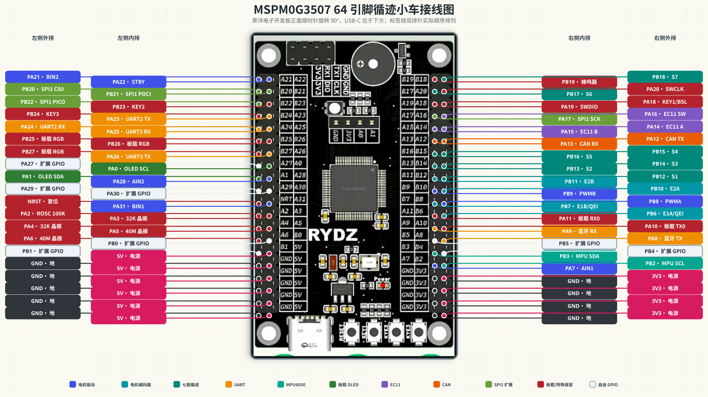
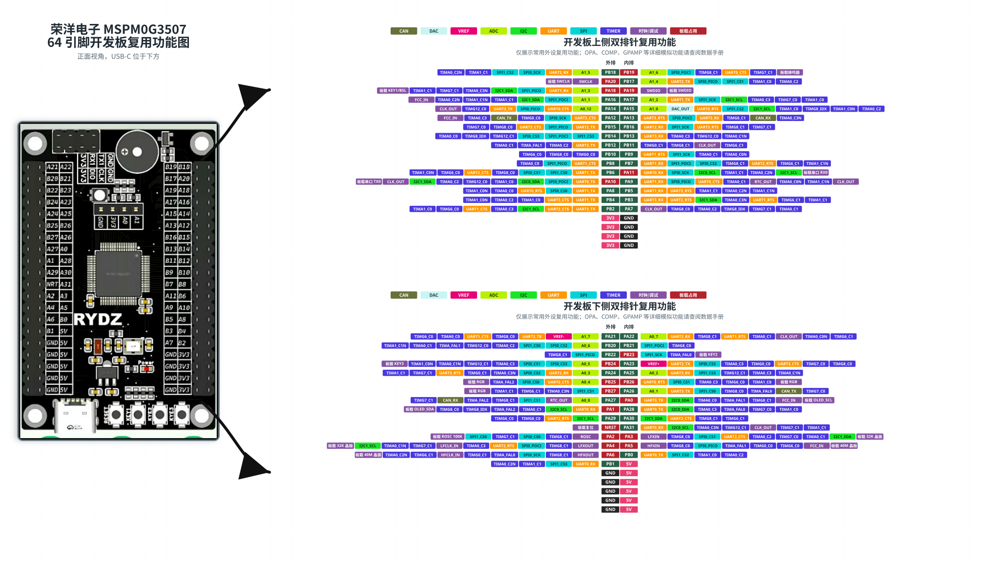

# MSPM0G3507 Seven-Channel Line Tracking Car

基于 TI MSPM0G3507 的七路循迹小车工程，主控板采用荣洋电子 MSPM0G3507 64 引脚开发板。硬件接口覆盖双路电机驱动、两路电机编码器、七路数字循迹、MPU6050、EC11 旋转编码器、蓝牙串口、板载 OLED，并额外预留两组 UART、一路 CAN 和一组完整 SPI1 扩展接口。

> [!IMPORTANT]
> 荣洋电子 64 引脚开发板与立创天猛星开发板的 MCU 封装、排针引脚顺序及板载资源连接存在差异，不能直接替换。接线、SysConfig 配置和程序中的引脚定义必须以本工程的分配为准。

## 引脚总览



图中红色标签表示板载占用或特殊保留引脚，不得分配给外部功能；浅灰色标签为当前未分配的自由 GPIO。开发板方向为正面视角，USB-C 接口位于下方。

## 开发板外设复用功能

[](mspm0g3507_64_peripheral_map.svg)

上图按照荣洋电子 64 引脚开发板的两组双排针实际顺序绘制，中间为外排和内排引脚，彩色标签表示该引脚可配置的常用外设复用功能。图片为 `3840×2160` 自包含 SVG；在 GitHub 中可以点击图片查看原始尺寸。

| 颜色分类 | 功能范围 |
|---|---|
| CAN | CAN-FD 控制器发送与接收信号 |
| DAC / VREF / ADC | 数模输出、电压基准和 ADC 模拟通道 |
| I2C | I2C0 / I2C1 时钟与数据信号 |
| UART | UART0-UART3 的 TX、RX、CTS 和 RTS |
| SPI | SPI0 / SPI1 的 SCK、PICO、POCI 和片选信号 |
| TIMER | TIMA0、TIMA1、TIMG0、TIMG6、TIMG7、TIMG8 和 TIMG12 通道 |
| 时钟/调试 | SWD、晶振、RTC、ROSC、FCC 和时钟输出功能 |
| 板载占用 | 已接 OLED、晶振、按键、蜂鸣器、RGB、串口或调试电路的引脚 |

为保证图片可读性，图中只列出常用外设复用、ADC/DAC/VREF、时钟和调试功能，没有展开 OPA、COMP、GPAMP 等完整模拟连接矩阵。需要使用这些模拟外设时，应查阅 MSPM0G3507 数据手册的“引脚属性”和“信号说明”章节，并在 SysConfig 中重新检查资源冲突。GPIO 是所有 PAx/PBx 引脚的基础功能，因此不在每个引脚旁重复标注。

## 引脚分配

| 功能 | 信号 | MSPM0G3507 引脚 | 外设功能 |
|---|---|---|---|
| 左电机 | PWMA | PB8 | `TIMA0.CCP0` PWM 输出 |
| 左电机 | AIN1 | PA7 | GPIO 输出 |
| 左电机 | AIN2 | PA28 | GPIO 输出 |
| 电机驱动使能 | STBY | PA22 | GPIO 输出，高电平使能 |
| 右电机 | BIN1 | PA31 | GPIO 输出 |
| 右电机 | BIN2 | PA21 | GPIO 输出 |
| 右电机 | PWMB | PB9 | `TIMA0.CCP1` PWM 输出 |
| 左电机编码器 | E1A | PB6 | `TIMG8.C0`，硬件 QEI |
| 左电机编码器 | E1B | PB7 | `TIMG8.C1`，硬件 QEI |
| 右电机编码器 | E2A | PB10 | GPIO 双边沿中断 |
| 右电机编码器 | E2B | PB11 | GPIO 双边沿中断 |
| 七路循迹 | S1-S7 | PB12-PB18 | GPIO 输入上拉 |
| 蓝牙 UART1 | MCU TX | PA8 | `UART1_TX` |
| 蓝牙 UART1 | MCU RX | PA9 | `UART1_RX` |
| 预留 UART2 | TX | PA23 | `UART2_TX` |
| 预留 UART2 | RX | PA24 | `UART2_RX` |
| 预留 UART3 | TX | PA26 | `UART3_TX` |
| 预留 UART3 | RX | PA25 | `UART3_RX` |
| CAN | TX | PA12 | `CAN_TX` |
| CAN | RX | PA13 | `CAN_RX` |
| MPU6050 | SCL | PB2 | `I2C1_SCL` |
| MPU6050 | SDA | PB3 | `I2C1_SDA` |
| EC11 | A | PA14 | GPIO 输入上拉 |
| EC11 | B | PA15 | GPIO 输入上拉 |
| EC11 | SW | PA16 | GPIO 输入上拉 |
| 板载 OLED | SCL | PA0 | GPIO 模拟 I2C |
| 板载 OLED | SDA | PA1 | GPIO 模拟 I2C |

以上外设实例和复用组合已通过 MSPM0G3507 LQFP-64 SysConfig 引脚冲突检查。

## 七路循迹模块

按小车前进方向定义左右：站在车尾看向车头，最左侧探头为 `S1`，中间探头为 `S4`，最右侧探头为 `S7`。

| 循迹通道 | MSPM0G3507 引脚 | 位置 |
|---|---|---|
| S1 | PB12 | 最左侧 |
| S2 | PB13 | 左侧 |
| S3 | PB14 | 左中 |
| S4 | PB15 | 中间 |
| S5 | PB16 | 右中 |
| S6 | PB17 | 右侧 |
| S7 | PB18 | 最右侧 |

七路输入连续分配在 `GPIOB` 的 `PB12-PB18`，便于统一采样和后续维护。建议配置为 GPIO 输入上拉，并通过软件参数兼容高电平有效或低电平有效的循迹模块。

循迹模块可按自身要求使用 5V 或 3.3V 供电，但输出到 MSPM0G3507 的信号电压不得超过 3.3V。

## 电机驱动与编码器

本分配适用于 TB6612FNG 一类双路电机驱动板。`PB8/PB9` 使用同一个 `TIMA0` 的两个比较通道产生双路 PWM，便于保持一致的 PWM 频率和计数周期。

| 驱动板接口 | MSPM0G3507 引脚 | 说明 |
|---|---|---|
| PWMA | PB8 | 左电机 PWM，`TIMA0.CCP0` |
| AIN1 | PA7 | 左电机方向控制 1 |
| AIN2 | PA28 | 左电机方向控制 2 |
| STBY | PA22 | 驱动使能，高电平工作 |
| BIN1 | PA31 | 右电机方向控制 1 |
| BIN2 | PA21 | 右电机方向控制 2 |
| PWMB | PB9 | 右电机 PWM，`TIMA0.CCP1` |
| E1A | PB6 | 左编码器 A 相，`TIMG8.C0` |
| E1B | PB7 | 左编码器 B 相，`TIMG8.C1` |
| E2A | PB10 | 右编码器 A 相，GPIO 双边沿中断 |
| E2B | PB11 | 右编码器 B 相，GPIO 双边沿中断 |

左编码器使用 `TIMG8` 硬件 QEI。右编码器使用 GPIO 双边沿中断进行软件正交解码，以保留其他定时器和通信资源。电机或编码器方向与程序定义相反时，应优先通过软件方向参数修正，不必重新分配引脚。

## MPU6050 与板载 OLED

### MPU6050

MPU6050 独立使用 `I2C1`：

| MPU6050 | MSPM0G3507 引脚 | 外设功能 |
|---|---|---|
| SCL | PB2 | `I2C1_SCL` |
| SDA | PB3 | `I2C1_SDA` |
| VCC | 3.3V | 建议使用 3.3V 供电 |
| GND | GND | 与开发板共地 |

建议将 I2C 总线配置为 `100kHz`，以提高杜邦线连接和多模块环境下的通信稳定性。SCL/SDA 上拉电阻必须连接到 3.3V，禁止上拉到 5V。

### 板载 OLED

开发板原理图将 `PA0` 连接到 `OLED_SCL`，将 `PA1` 连接到 `OLED_SDA`；而 MSPM0G3507 的硬件 `I2C0` 复用方向为 `PA0=I2C0_SDA`、`PA1=I2C0_SCL`。两者方向相反，因此板载 OLED 使用 GPIO 模拟 I2C：

| 板载 OLED | MSPM0G3507 引脚 | 配置 |
|---|---|---|
| SCL | PA0 | GPIO 模拟时钟 |
| SDA | PA1 | GPIO 模拟数据 |

板载 OLED 不与 MPU6050 共用硬件 I2C 总线。OLED 驱动需要采用 GPIO 开漏时序，释放总线时将引脚切换为输入或开漏高阻状态，不应使用推挽高电平与板载上拉电阻对冲。

## EC11 旋转编码器

| EC11 引脚 | MSPM0G3507 引脚 | 配置 |
|---|---|---|
| A | PA14 | GPIO 输入上拉 |
| B | PA15 | GPIO 输入上拉 |
| C / COM | GND | 旋转公共端 |
| SW | PA16 | GPIO 输入上拉 |
| SW-COM | GND | 按键公共端 |

EC11 的 A、B 和 SW 均按低电平有效处理，并在软件中进行旋转状态滤波和按键消抖。使用带转接板的 EC11 模块时，应确认模块输出电压不超过 3.3V。

## 串口通信

### 蓝牙 UART1

蓝牙模块使用 `UART1`，适用于 JDY-31-SPP、HC-05 等透明串口模块。

| 蓝牙模块 | MSPM0G3507 引脚 | 连接关系 |
|---|---|---|
| TXD | PA9 | 接 MCU `UART1_RX` |
| RXD | PA8 | 接 MCU `UART1_TX` |
| VCC | 3.3V-5V | 手册建议使用 5V 供电 |
| GND | GND | 与开发板共地 |

模块 TXD 与 MCU RX 交叉连接，模块 RXD 与 MCU TX 交叉连接。通信引脚电平为 3.3V。建议默认使用 `115200-8-N-1`，不启用硬件流控。

### OLED 蓝牙接收测试模式

应用显示模式在 `app_config.h` 中通过 `APP_DISPLAY_MODE` 选择：

```c
#define APP_DISPLAY_MODE APP_DISPLAY_MODE_BLUETOOTH_RX
```

- `APP_DISPLAY_MODE_BLUETOOTH_RX`：默认测试模式。OLED 首行显示 `BT RX 115200 8N1`，其余七行显示 UART1 接收的可打印 ASCII 文本。
- `APP_DISPLAY_MODE_PROBLEM_SELECT`：恢复原有 EC11 选题和题号显示界面。

蓝牙测试模式仅显示收到的数据，不执行 `STOP`、`START`、PID 或 VOFA 等调试命令，也不主动发送遥测数据，因此不会通过串口修改小车控制状态。循迹控制仍由原定时器中断独立运行。

电脑端测试步骤：

1. HC-05 使用透明传输从机模式，正常通信波特率为 `115200`；AT 配置模式使用的 `38400` 不适用于本测试。
2. 电脑与模块配对，默认名称为 `HC-05`、默认配对码为 `1234`，然后打开对应的经典蓝牙 SPP 串口。
3. 串口助手选择 `115200 / 8 数据位 / 1 停止位 / 无校验 / 无流控`，并勾选发送新行。
4. 发送 `Hello 123`。收到 CR、LF 或 CRLF 后，OLED 提交一行；每行最多 21 个字符，超长文本自动换行，超过七行后向上滚动。
5. 不可打印字节显示为 `.`；接收环形缓冲区来不及处理时显示 `RX OVERFLOW`。

### 预留 UART2 与 UART3

| 接口 | TX | RX | 用途 |
|---|---|---|---|
| UART2 | PA23 | PA24 | 扩展串口设备或调试接口 |
| UART3 | PA26 | PA25 | 扩展串口设备或调试接口 |

蓝牙串口之外额外保留两组完整 UART，共提供三组应用串口。开发板板载的 `PA10/PA11` 串口接口保持保留状态，不参与本工程外设分配。

## CAN 通信

| CAN 信号 | MSPM0G3507 引脚 | 外设功能 |
|---|---|---|
| CAN_TX | PA12 | `CAN_TX` |
| CAN_RX | PA13 | `CAN_RX` |

`PA12/PA13` 是 MCU 侧的 CAN 控制器逻辑信号，不能直接连接 CANH/CANL。实际总线必须外接支持 3.3V MCU 逻辑电平的 CAN 收发器，并根据总线拓扑在两端配置 120Ω 终端电阻。CAN 收发器、开发板和整车电源系统必须共地。

## 扩展接口

### 预留 SPI1

保留一组连续且完整的 SPI1 接口，供后续增加高速传感器、无线模块、Flash、SD 卡或其他比赛外设：

| SPI1 信号 | MSPM0G3507 引脚 |
|---|---|
| SCK | PA17 |
| PICO / MOSI | PB22 |
| POCI / MISO | PB21 |
| CS0 | PB20 |

### 自由 GPIO

当前未分配的通用扩展引脚如下：

| 引脚 | 可选扩展方向 |
|---|---|
| PB0 / PB1 | GPIO、UART0 或定时器功能 |
| PB4 / PB5 | GPIO、UART1 或高级定时器功能 |
| PA27 | GPIO、ADC、CAN_RX 或定时器功能 |
| PA29 / PA30 | GPIO、I2C1 或 TIMG8 功能 |

新增外设前应重新检查 SysConfig 资源冲突，避免占用本工程已经使用的定时器通道、串口实例或板载资源。

## 板载资源与特殊引脚

以下引脚已经连接到开发板板载电路或承担启动、时钟、调试功能，不得重新分配：

| 引脚 | 板载连接或特殊功能 |
|---|---|
| PA2 | ROSC 外接 100kΩ 电阻 |
| PA3 / PA4 | 32.768kHz 低速晶振 |
| PA5 / PA6 | 40MHz 高速晶振 |
| PA10 / PA11 | 板载串口接口 |
| PA18 | KEY1，同时为 BSL 调用引脚 |
| PA19 / PA20 | SWDIO / SWCLK 调试接口 |
| PB19 | 板载蜂鸣器 |
| PB23 / PB24 | 板载 KEY2 / KEY3 |
| PB25 / PB26 / PB27 | 板载 RGB LED |
| NRST | 硬件复位 |

`PA0/PA1` 已专用于板载 OLED，也不能同时连接其他外设。SWD 调试接口必须始终保留，以保证程序下载和比赛现场调试能力。

## 接线与电气要求

- 所有进入 MSPM0G3507 的数字或模拟信号不得超过 3.3V。
- 开发板、电机驱动、编码器、循迹模块、MPU6050、蓝牙模块、CAN 收发器及电池系统必须共地。
- 电机电源应按电机额定电压单独设计，不得由 MCU 的 3.3V 引脚供电。
- 感性负载和电机电源应做好退耦、反接保护及浪涌抑制，信号线与电机动力线尽量分开布置。
- I2C、编码器和循迹信号线不宜过长；比赛车辆上应固定连接器，避免使用容易松脱的临时接线。
- 未使用引脚应在 SysConfig 中配置为 GPIO 输出低电平，或配置为带内部上拉/下拉的输入，避免悬空。
